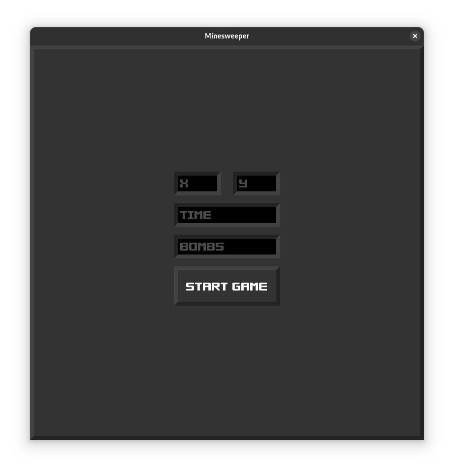
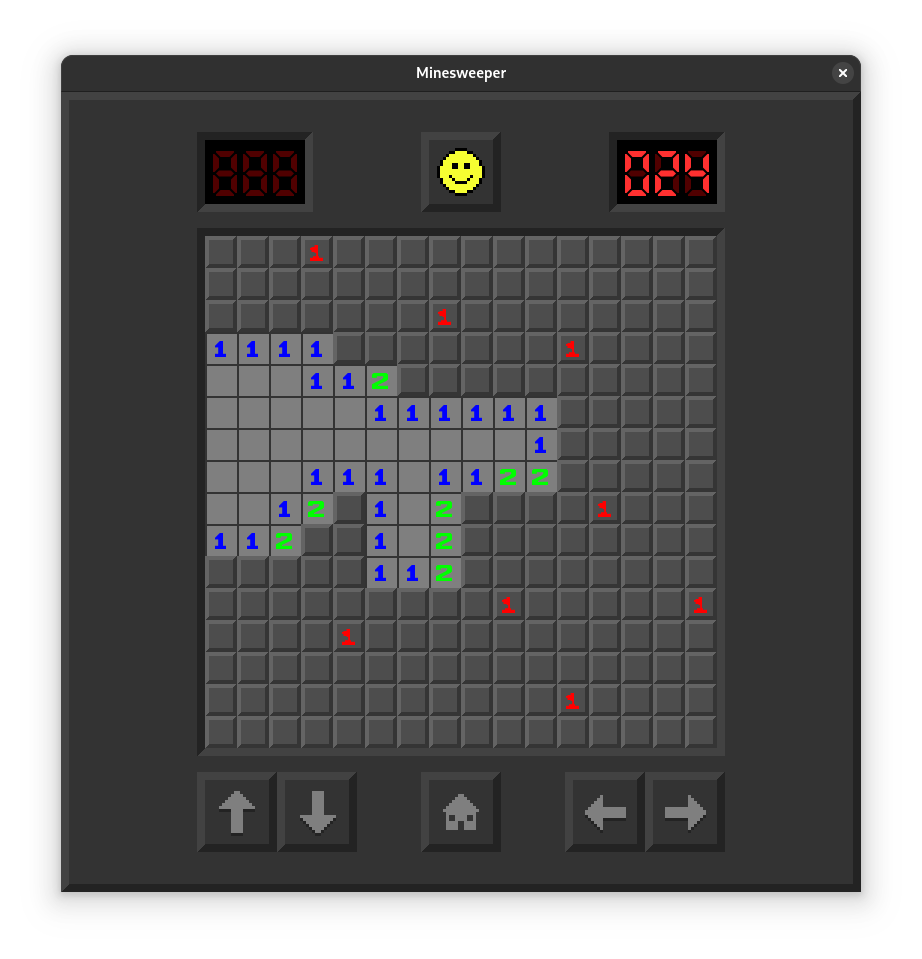
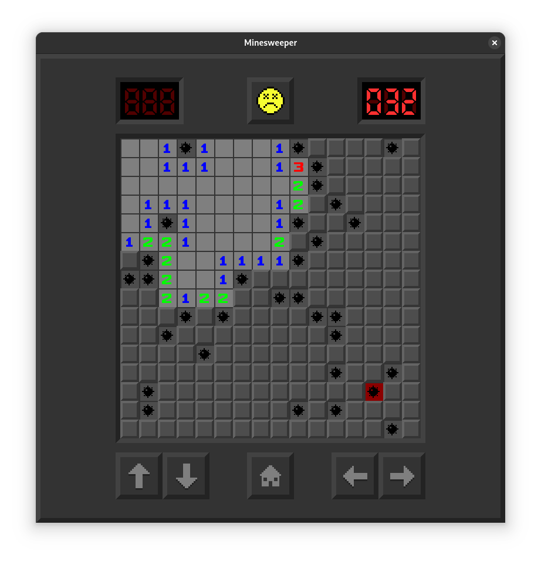

# Minesweeper

This project is an implementation of the Minesweeper game, done in Pygame.

## How to play

```bash
# 1. create venv
python3 -m venv .venv
# 2. enter venv
source .venv/bin/activate
# 3. install pygame
pip install pygame
# 4. play
python3 src/main.py
```

## About the game

The home screen has 4 inputs that allow the player to modify the different parameters of the game:
- x, y: the dimensions of the board, at least 4x4, at most your RAM size, default is 16x16
- time: if you want to feel time pressured, use a non-zero value to start a timer while you play, default is 0 (disabled)
- bombs: if you feel courageous, input a different number of bombs to increase/lower difficulty, default is 12.5% bombs (`xy/8`)



The game is just the classic minesweeper. The controls are the following:
- left click: reveal zone
- right click: flag/un-flag zone
- arrows: move around the board if the dimensions are bigger than 16x16

The top-left counter is for the timer, the top-right counter is for the number of flags left.
The smiley button resets the current game. The home button goes back to the starting screen. The arrow buttons do the same thing as the arrow keys.



